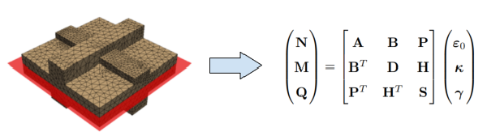

==========================================================================================
Theoretical Development and Software Implementation of an Asymptotic Homogenization Method
==========================================================================================

Keywords
========

Delphi, Finite Element Analysis, Optimization, Graph Theory, Structural Analysis, Homogenization, Composites, 
Combinatorial Optimization, Research, Software Development

Overview
========

I've designed and implemented a software tool for the analysis of structures with periodic microstructures 
using an asymptotic homogenization method. This method allows for the effective modeling of complex materials 
with periodic features, such as composites, foams, and lattice structures. The software tool provides accurate 
predictions of the macroscopic behavior of these materials based on their microstructural properties.
The implemented algorithm is an improvement over existing methods, based on my research, further enhancing the
capabilities of homogenization techniques in structural analysis. The solution is in use in the structural analysis
and design software `AxisVM <https://axisvm.eu/>`. As of my knowledge, this is the first implementation of such an
algorithm in a commercial software package for civil engineering design purposes.

   
   Illustration of the homogenization process for a ribbed plate.
   
   
Features
========

- **Automatic calculation of equivalent model stiffness matrices:** The algorithm is capable to determining
  equivalent stiffness matrices of partcically any kind of shell with a periodic microstructure. A key feature of the
  solution is the ability to handle the most complex of geometries and material properties. It uses a 3d RVE and
  determines the stiffness matrix for a 2d model using a retrofitting approach, which is an original contribution.

Technologies Used
=================

- **Delphi:** Core programming language for developing the algorithms used in AxisVM.
- **Finite Element Analysis:** Utilized for the numerical solution of the homogenization equations.
- **Optimization Techniques:** Implemented to improve the efficiency and accuracy of the calculations.
- **Frontal Method Solver:** Developed for solving the linear systems of equations arising from the homogenization process.
- **Graph Theory-Based Optimization:** Used to minimize the bandwidth of the coefficient matrix for improved computational efficiency,
  falling in the category of combinatorial optimization.

Challenges and Solutions
========================

- **Standalone Implementation:** Using legacy code was not an option due to technical difficulties. Therefore, the 
  implementation comes with it's own finite elements, equation solver, pre- and postprocessing
  tools, etc. This also involves the implementation of a direct equation solver (frontal method), accompanied by an 
  optimizer that renumbers the elements such that the coefficient matrix has minimal bandwidth. Here I implemented King's 
  method.
- **Mathematical Complexity:** The theory behind the solution is based on advanced mathematical concepts, such as 
  two-scale asymptotic expansion, differential equations and retrofitting. Implementing these concepts in a practical software 
  tool required a deep understanding of both the theoretical and computational aspects. I had to develop a robust algorithm that 
  could handle the complexity of the calculations while maintaining efficiency and accuracy. This involved extensive testing and 
  validation to ensure the correctness of the results.

Conclusion
==========

The project showcases my abilities in theoretical research, algorithm development, and software implementation and problem 
solving in general. It is one thing to read a book and implement the algorithms described in it, but it is a completely different 
challenge to take an existing theory and improve it, makeing it more suitable to a given problem. This requires a deep understanding
of the underlying principles, as well as creativity and problem-solving skills.
