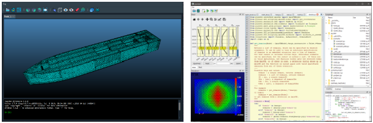

.. _Structural Design of a Catamaran Using a Self-Developed Finite Element Software:

===============================================================================
Structural Design of a Catamaran Using a Self-Developed Finite Element Software
===============================================================================

Keywords
========

Python, Finite Element Analysis, Composite Mechanics, Research, Software Development, Structural Analysis, 
API, Graphical User Interface, Catamaran Design

Overview
========

In 2019, I was tasked with the structural assessment and design of a catamaran hull on behalf of `WIA <https://elektromosyacht.hu/en/>`_. 
The project involved the development of a custom finite element software tool to analyze the stress distribution
and deformation of the hull under various loading conditions. Finally, I created a MatLab-like GUI to support making
engineering decisions.

   
   Screenshots about the final software product.

.. figure:: ../_static/catamaran_prototype.png
   :align: center
   
   Screenshots about the prorotype.
   
Features
========

- **Complete calculation of a Catamaran Hull:** The software had to be able to support all calculations related to the
  structural design of a catamaran hull, made from glass-reinforced plastic (GRP). This included the determination of
  the stress distribution, deformation, and load paths in the hull.
- **Graphical visualization of results:** The software also had to be able to visualize important metrics used for
  making engineering decisions.

Technologies Used
=================

- **Python:** Core programming language I used to develop my finite element library, and later the whole software.
- **NumPy:** Used for numerical calculations and linear algebra operations.
- **SciPy:** Utilized for scientific computing and optimization algorithms.
- **Numba:** A static JIT-compiler I used to write performant code in Python. This was crucial in finding a balanced
  solution between speed and development time.
- **Matplotlib:** Utilized for plotting stress distributions and deformation profiles.
- **VTK**: Used for 3D visualization of the results.
- **Qt:** Used to develop the GUI.
- **AxisVM:** I used AxisVM through it's API to apply the loads and to design the steel parts of the catamaran.

Challenges and Solutions
========================

- **Low budget:** The project had a relatively low budget, purchasing software like ANSYS or Abaqus was out of reach. Thankfully,
  at the time I already had my own finite element library, which I developed during my PhD studies, and I only had to extend it
  with capabilities related to composite materials and multi-layeres shells. Also, I had no graphical user interface, so I had to
  develop one from scratch. I decided to do this in Qt, using Python frameworks.
- **Tight deadline:** I joined the project mid-way, and the deadline was approaching fast. I had to make sure that the software 
  was reliable and accurate, but I also had to be fast. This required me to carefully balance between using existing and affordable
  solutions wherever possible, and integrate them with my own code. For these reasons, I decided to do the software in Python, thanks
  to it's extensive libraries that granted me the productivity I needed. Using libraries like Numba gave me the speed I needed,
  while keeping the productivity of Python. I also used the AxisVM API to apply the loads, which saved me a lot of time.
- **Complex workflow**: The design of the catamaran was done in Rhino and I had to be able to create an efficient workflow that
  makes design iterations as fast as possible. I had to develop a plugin for Rhino that could export the geometry to my software,
  create the finite element mesh, apply the loads in AxisVM, export the loads into the developed software, where then
  the calculation was carried out. The results were then visualized in the software, and the user could make design decisions,
  and the whole procedure was repeated until the design was satisfactory.

Conclusion
==========

This project demonstrates my expertise in developing custom software solutions for complex engineering problems under stringent constraints. 
The structural design of the catamaran using a self-developed finite element software underscores my ability to deliver high-quality results 
within tight deadlines and budget limitations.
